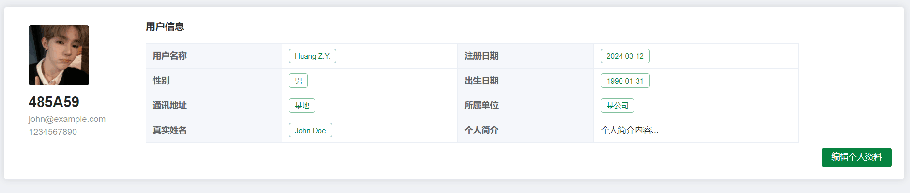

## 项目介绍
`erosion-watch` 项目是一套土壤侵蚀程度调查分析系统，包括数据监测和数据分析两部分。在数据分析模块，分为专业的土壤数据分析以及通用数据分析两部分。首先可导入 excel 表格到后台，后台结合 Apache Common Math 和 TableSaw 数据进行例如线性回归分析，描述性分析，相关性分析等操作。针对专业数据分析，结合专业公式得出相关因子，并给出治理建议。除此之外，该项目还支持文献检索功能，可识别上传的 PDF 文件并存入 ES 中，实现全文搜索。同时，本系统还支持邮箱验证码登录功能，统计每日访问量和点击量等数据。 

### 项目结构

```
erosion-watch
├── eroison-watch-common -- 工具类及通用代码
├── eroison-watch-mbg -- MyBatisGenerator生成的数据库操作代码
├── eroison-watch-security -- SpringSecurity封装公用模块
└── eroison-watch-portal -- 前台商城系统接口
```

### 技术选型

#### 后端技术

| 技术             | 说明                | 官网                                                |
| ---------------- | ------------------- | --------------------------------------------------- |
| SpringBoot       | Web应用开发框架     | https://spring.io/projects/spring-boot              |
| SpringSecurity   | 认证和授权框架      | https://spring.io/projects/spring-security          |
| MyBatis          | ORM框架             | http://www.mybatis.org/mybatis-3/zh/index.html      |
| MyBatisGenerator | 数据层代码生成器    | http://www.mybatis.org/generator/index.html         |
| Elasticsearch    | 搜索引擎            | https://github.com/elastic/elasticsearch            |
| RabbitMQ         | 消息队列            | https://www.rabbitmq.com/                           |
| Redis            | 内存数据存储        | https://redis.io/                                   |
| MongoDB          | NoSql数据库         | [https://www.mongodb.com](https://www.mongodb.com/) |
| Druid            | 数据库连接池        | https://github.com/alibaba/druid                    |
| MinIO            | 对象存储            | https://github.com/minio/minio                      |
| Easy Excel       | Excel数据处理       | https://easyexcel.opensource.alibaba.com/           |
| Common Math      | 数据分析处理        | https://commons.apache.org/proper/commons-math/     |
| TableSaw         | 数据可视化          | https://github.com/jtablesaw/tablesaw               |
| JWT              | JWT登录支持         | https://github.com/jwtk/jjwt                        |
| Lombok           | Java语言增强库      | https://github.com/rzwitserloot/lombok              |
| Hutool           | Java工具类库        | https://github.com/looly/hutool                     |
| PageHelper       | MyBatis物理分页插件 | http://git.oschina.net/free/Mybatis_PageHelper      |
| Knife4j          | API文档生成工具     | https://doc.xiaominfo.com/                          |

#### 前端技术

| 技术         | 说明                  | 官网                                                  |
| ------------ | --------------------- | ----------------------------------------------------- |
| Vue          | 前端框架              | https://vuejs.org/                                    |
| Vue-router   | 路由框架              | https://router.vuejs.org/                             |
| Vuex         | 全局状态管理框架      | https://vuex.vuejs.org/                               |
| Element      | 前端UI框架            | [https://element.eleme.io](https://element.eleme.io/) |
| Axios        | 前端HTTP框架          | https://github.com/axios/axios                        |
| v-charts     | 基于Echarts的图表框架 | https://v-charts.js.org/                              |
| Js-cookie    | cookie管理工具        | https://github.com/js-cookie/js-cookie                |
| nprogress    | 进度条控件            | https://github.com/rstacruz/nprogress                 |
| Handsontable | Excel 表格            | https://handsontable.com/                             |

### 架构图


### 项目演示

在线分析输入界面

在线分析结果界面

我的数据界面

文件重命名

文件上传界面

上传成功提示

excel 数据展示

基于表格数据分析

监测管理
区域信息

新增区域信息

土壤类型

新增土壤类型

植被覆盖

新增植被覆盖

地形地貌

新增地形地貌

侵蚀等级

新增侵蚀等级

监测数据

新增监测数据


土地使用历史


新增土地使用历史


土地规划


新增土地规划


文献资源查看


地图资源


用户登录


用户注册


用户信息查看



用户信息编辑


