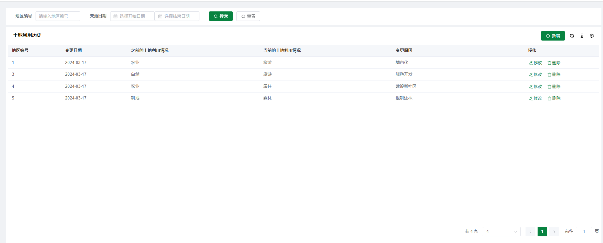
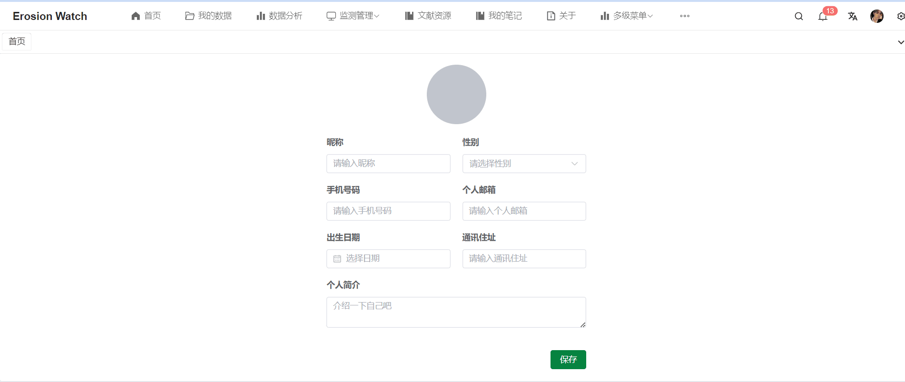

## 项目介绍
`erosion-watch` 项目是一套土壤侵蚀程度调查分析系统，包括数据监测和数据分析两部分。在数据分析模块，分为专业的土壤数据分析以及通用数据分析两部分。首先可导入 excel 表格到后台，后台结合 Apache Common Math 和 TableSaw 数据进行例如线性回归分析，描述性分析，相关性分析等操作。针对专业数据分析，结合专业公式得出相关因子，并给出治理建议。除此之外，该项目还支持文献检索功能，可识别上传的 PDF 文件并存入 ES 中，实现全文搜索。同时，本系统还支持邮箱验证码登录功能，统计每日访问量和点击量等数据。 

### 项目结构

```
erosion-watch
├── eroison-watch-common -- 工具类及通用代码
├── eroison-watch-mbg -- MyBatisGenerator生成的数据库操作代码
├── eroison-watch-security -- SpringSecurity封装公用模块
└── eroison-watch-portal -- 前台商城系统接口
```

### 技术选型

#### 后端技术

| 技术             | 说明                | 官网                                                |
| ---------------- | ------------------- | --------------------------------------------------- |
| SpringBoot       | Web应用开发框架     | https://spring.io/projects/spring-boot              |
| SpringSecurity   | 认证和授权框架      | https://spring.io/projects/spring-security          |
| MyBatis          | ORM框架             | http://www.mybatis.org/mybatis-3/zh/index.html      |
| MyBatisGenerator | 数据层代码生成器    | http://www.mybatis.org/generator/index.html         |
| Elasticsearch    | 搜索引擎            | https://github.com/elastic/elasticsearch            |
| RabbitMQ         | 消息队列            | https://www.rabbitmq.com/                           |
| Redis            | 内存数据存储        | https://redis.io/                                   |
| MongoDB          | NoSql数据库         | [https://www.mongodb.com](https://www.mongodb.com/) |
| Druid            | 数据库连接池        | https://github.com/alibaba/druid                    |
| MinIO            | 对象存储            | https://github.com/minio/minio                      |
| Easy Excel       | Excel数据处理       | https://easyexcel.opensource.alibaba.com/           |
| Common Math      | 数据分析处理        | https://commons.apache.org/proper/commons-math/     |
| TableSaw         | 数据可视化          | https://github.com/jtablesaw/tablesaw               |
| JWT              | JWT登录支持         | https://github.com/jwtk/jjwt                        |
| Lombok           | Java语言增强库      | https://github.com/rzwitserloot/lombok              |
| Hutool           | Java工具类库        | https://github.com/looly/hutool                     |
| PageHelper       | MyBatis物理分页插件 | http://git.oschina.net/free/Mybatis_PageHelper      |
| Knife4j          | API文档生成工具     | https://doc.xiaominfo.com/                          |

#### 前端技术

| 技术         | 说明                  | 官网                                                  |
| ------------ | --------------------- | ----------------------------------------------------- |
| Vue          | 前端框架              | https://vuejs.org/                                    |
| Vue-router   | 路由框架              | https://router.vuejs.org/                             |
| Vuex         | 全局状态管理框架      | https://vuex.vuejs.org/                               |
| Element      | 前端UI框架            | [https://element.eleme.io](https://element.eleme.io/) |
| Axios        | 前端HTTP框架          | https://github.com/axios/axios                        |
| v-charts     | 基于Echarts的图表框架 | https://v-charts.js.org/                              |
| Js-cookie    | cookie管理工具        | https://github.com/js-cookie/js-cookie                |
| nprogress    | 进度条控件            | https://github.com/rstacruz/nprogress                 |
| Handsontable | Excel 表格            | https://handsontable.com/                             |

### 架构图


### 项目演示

在线分析输入界面


在线分析结果界面


我的数据界面


文件重命名


文件上传界面


上传成功提示


excel 数据展示


基于表格数据分析


监测管理

区域信息


新增区域信息


土壤类型


新增土壤类型


植被覆盖


新增植被覆盖


地形地貌


新增地形地貌


侵蚀等级


新增侵蚀等级


监测数据


新增监测数据


土地使用历史


新增土地使用历史




土地规划


新增土地规划


文献资源查看


地图资源


用户登录


用户注册


用户信息查看


用户信息编辑




## 数据库表结构

数据库表结构概览


**soil_type 表**

| **列名**      | **数据类型** | **说明**       |
| ------------- | ------------ | -------------- |
| id            | bigint       | 主键           |
| parent_id     | bigint       | 上级分类的编号 |
| name          | varchar(64)  | 土壤类型名称   |
| level         | int(1)       | 分类级别       |
| soil_quality  | varchar(64)  | 土壤质地       |
| soil_moisture | varchar(64)  | 土壤含水量     |
| description   | text         | 描述           |

**vegetation_coverage 表**

| **列名**            | **数据类型** | **说明**   |
| ------------------- | ------------ | ---------- |
| id                  | bigint       | 主键       |
| area_id             | bigint       | 地区ID     |
| vegetation_type     | varchar(100) | 植被类型   |
| coverage_percentage | decimal(5,2) | 覆盖百分比 |
| density             | varchar(50)  | 植被密度   |
| status              | int(1)       | 植被状态   |
| remarks             | text         | 备注       |

**area_info 表**

| **列名**            | **数据类型**   | **说明**     |
| ------------------- | -------------- | ------------ |
| id                  | bigint         | 主键         |
| area_name           | varchar(100)   | 地区名称     |
| administrative_code | varchar(20)    | 行政区划代码 |
| latitude            | decimal(9, 6)  | 纬度         |
| longitude           | decimal(9, 6)  | 经度         |
| area                | decimal(10, 2) | 面积         |
| population          | int            | 人口         |
| climate_type        | varchar(50)    | 气候类型     |
| terrain_feature     | varchar(50)    | 地形特征     |
| landform_feature    | varchar(50)    | 地貌特征     |
| land_use            | varchar(50)    | 土地利用情况 |

**member 表**

| **列名**          | **数据类型** | **说明**     |
| ----------------- | ------------ | ------------ |
| id                | bigint       | 主键         |
| username          | varchar(50)  | 用户名       |
| password          | varchar(100) | 密码         |
| nickname          | varchar(100) | 昵称         |
| email             | varchar(100) | 邮箱         |
| registration_date | datetime     | 注册日期     |
| last_login        | datetime     | 上次登录时间 |
| first_name        | varchar(50)  | 用户的名     |
| last_name         | varchar(50)  | 用户的姓     |
| gender            | enum         | 性别         |
| date_of_birth     | date         | 出生日期     |
| address           | varchar(255) | 地址         |
| phone_number      | varchar(20)  | 电话号码     |
| profile_picture   | varchar(255) | 个人头像路径 |
| biography         | text         | 个人简介     |
| organization      | varchar(100) | 所属单位     |
| real_name         | varchar(100) | 真实姓名     |

**terrain_landform 表**

| **列名**        | **数据类型**   | **说明**             |
| --------------- | -------------- | -------------------- |
| id              | bigint         | 主键                 |
| area_id         | bigint         | 地区ID               |
| terrain_type    | varchar(50)    | 地形类型             |
| landform_type   | varchar(50)    | 地貌类型             |
| elevation       | decimal(10, 2) | 海拔高度（单位：米） |
| slope           | decimal(10, 2) | 坡度（单位：度）     |
| soil_type       | varchar(100)   | 土壤类型             |
| vegetation_type | varchar(100)   | 植被类型             |
| water_system    | varchar(100)   | 水系类型             |

**soil_erosion_grade 表**

| **列名**               | **数据类型** | **说明**             |
| ---------------------- | ------------ | -------------------- |
| id                     | bigint       | 主键                 |
| area_id                | bigint       | 地区ID               |
| erosion_type           | varchar(50)  | 侵蚀类型             |
| erosion_grade          | varchar(20)  | 侵蚀等级             |
| erosion_years          | int          | 抗蚀年限（单位：年） |
| erosion_description    | text         | 侵蚀描述             |
| risk_level             | varchar(20)  | 风险等级             |
| risk_assessment_result | text         | 风险评估结果         |
| management_practice    | text         | 管理措施             |

**monitoring_data 表**

| **列名**                 | **数据类型**  | **说明**             |
| ------------------------ | ------------- | -------------------- |
| id                       | bigint        | 主键                 |
| area_id                  | bigint        | 地区ID               |
| monitoring_date          | date          | 监测日期             |
| soil_erosion_rate        | decimal(5,2)  | 土壤侵蚀率           |
| vegetation_coverage_rate | decimal(5,2)  | 植被覆盖率           |
| rainfall_amount          | decimal(10,2) | 降雨量（单位：毫米） |

**land_use_change_history 表**

| **列名**          | **数据类型** | **说明**           |
| ----------------- | ------------ | ------------------ |
| id                | bigint       | 主键               |
| area_id           | bigint       | 地区ID             |
| change_date       | date         | 变更日期           |
| previous_land_use | varchar(50)  | 之前的土地利用情况 |
| current_land_use  | varchar(50)  | 当前的土地利用情况 |
| change_reason     | text         | 变更原因           |

**land_management_plans 表**

| **列名**            | **数据类型** | **说明**              |
| ------------------- | ------------ | --------------------- |
| id                  | bigint       | 主键                  |
| area_id             | bigint       | 地区ID                |
| plan_date           | date         | 计划日期              |
| plan_type           | varchar(50)  | 计划类型（规划/项目） |
| plan_content        | text         | 计划内容              |
| responsible_unit    | varchar(100) | 责任单位              |
| implementation_date | date         | 实施日期              |

